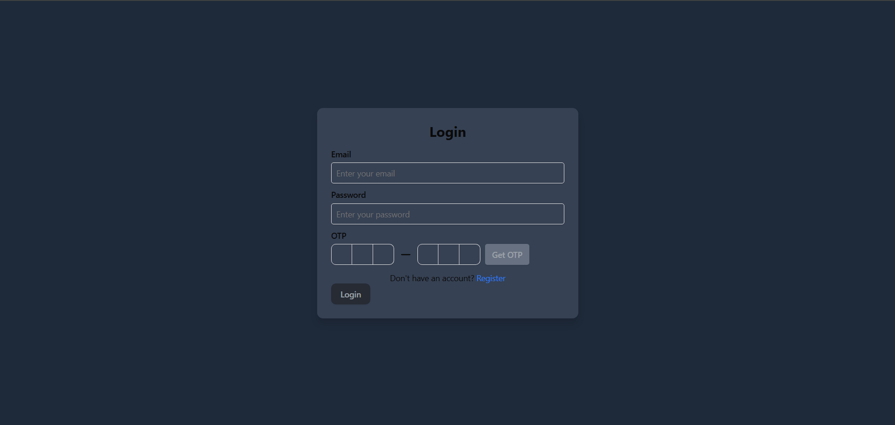
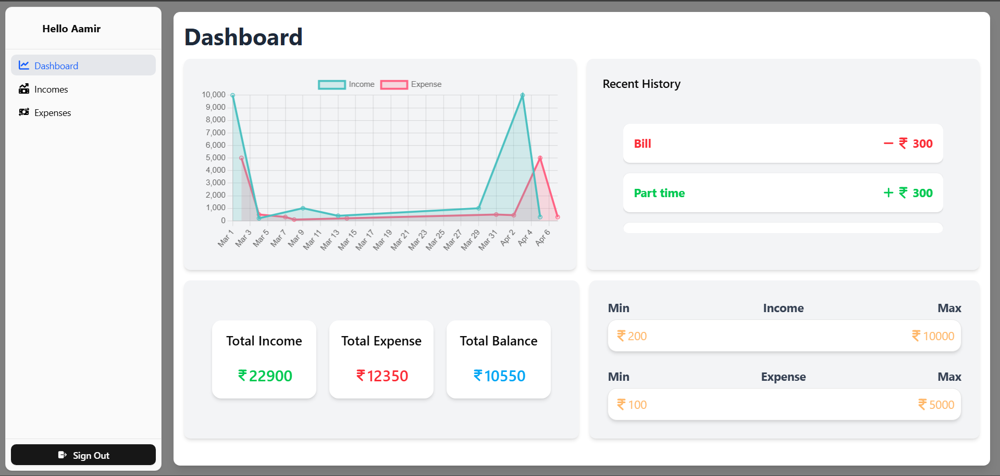
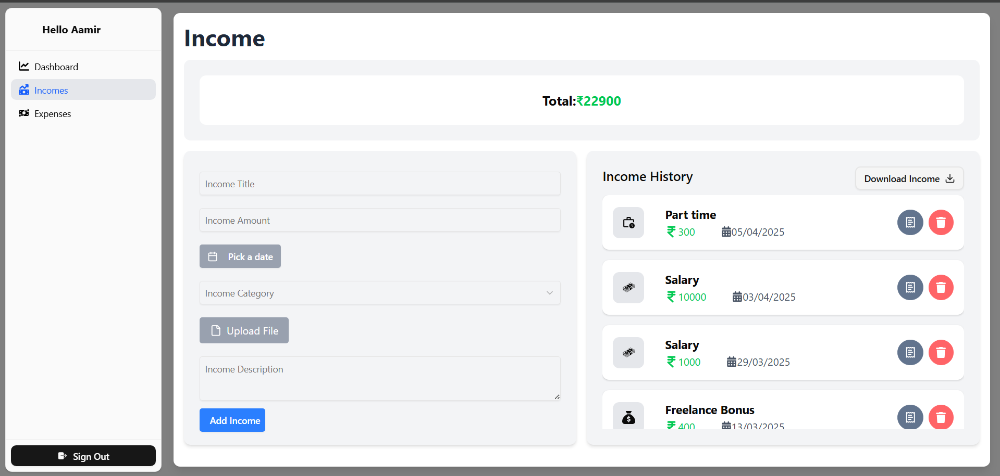
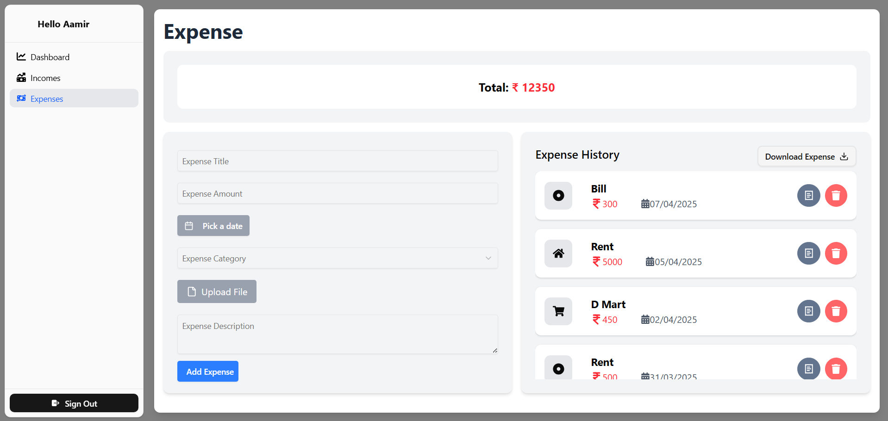

# Expense Tracker

A **full-stack MERN (MongoDB, Express, React, Node.js) application** to track your expenses, visualize spending patterns, and manage personal finance efficiently. This project includes a backend API with Node.js/Express and a React frontend.

---

## Table of Contents

- [Features](#features)  
- [Tech Stack](#tech-stack)  
- [Screenshots](#screenshots)  
- [Getting Started](#getting-started)  
  - [Prerequisites](#prerequisites)  
  - [Installation](#installation)  
  - [Running Locally](#running-locally)  
- [Docker Setup](#docker-setup)  
- [Folder Structure](#folder-structure)  
- [API Endpoints](#api-endpoints)  
- [Contributing](#contributing)  
- [License](#license)  

---

## Features

- Add, edit, and delete expenses  
- Categorize expenses for better tracking  
- Visual dashboard with charts and statistics  
- Real-time updates  
- Responsive and user-friendly UI  

---

## Tech Stack

- **Frontend:** React, Vite, Tailwind CSS  
- **Backend:** Node.js, Express  
- **Database:** MongoDB  
- **Authentication:** JWT (JSON Web Tokens)  
- **Tools:** Docker, Nodemon, Postman  

---

## Screenshots

 
  

  
*Replace with your actual screenshots from the `screenshots` folder.*

---

## Getting Started

### Prerequisites

- Node.js >= 18.x  
- npm >= 9.x  
- MongoDB (local or Atlas)  
- Docker (optional, for containerized setup)  

### Installation

1. Clone the repo:

```bash
git clone https://github.com/Aamirali002/Expense-Tracker.git
cd Expense-Tracker
```

2. Install dependencies:

**Backend:**

```bash
cd server
npm install
```

**Frontend:**

```bash
cd ../client
npm install
```

### Running Locally

**Backend:**

```bash
cd server
npm run dev
```

**Frontend:**

```bash
cd client
npm run dev
```

- Open `http://localhost:5173` (or the port Vite provides) in your browser.  

---

## Docker Setup

You can run the project using Docker containers:

1. Build and run containers:

```bash
docker-compose up --build
```

2. Access:

- Backend: `http://localhost:5000`  
- Frontend: `http://localhost:5173`  

---

## Folder Structure

```
Expense-Tracker/
│
├─ client/            # React frontend
│  ├─ src/
│  └─ package.json
│
├─ server/            # Node.js backend
│  ├─ routes/
│  ├─ models/
│  ├─ controllers/
│  └─ server.js
│
├─ .gitignore
├─ docker-compose.yml
├─ README.md
└─ package.json
```

---

## API Endpoints (Backend)

- `POST /api/users/register` – Register a new user  
- `POST /api/users/login` – Login user and get token  
- `GET /api/expenses` – Get all expenses for logged-in user  
- `POST /api/expenses` – Add a new expense  
- `PUT /api/expenses/:id` – Update expense by ID  
- `DELETE /api/expenses/:id` – Delete expense by ID  

*Use Postman or similar tool for testing endpoints.*

---

## Contributing

1. Fork the repository  
2. Create your feature branch (`git checkout -b feature-name`)  
3. Commit your changes (`git commit -m "Add new feature"`)  
4. Push to the branch (`git push origin feature-name`)  
5. Open a Pull Request  

---

## License

This project is licensed under the MIT License. See the [LICENSE](LICENSE) file for details.
